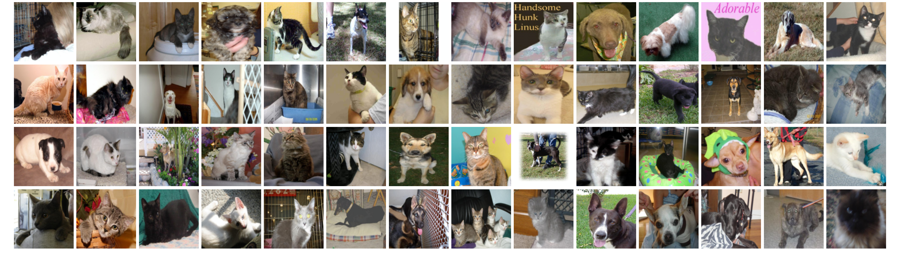
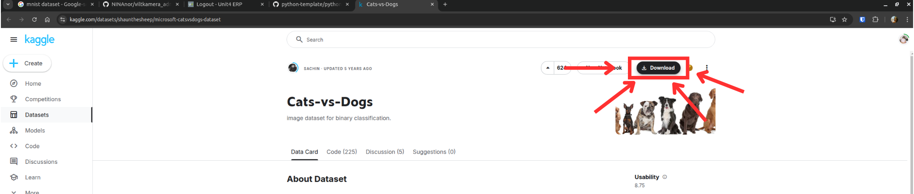
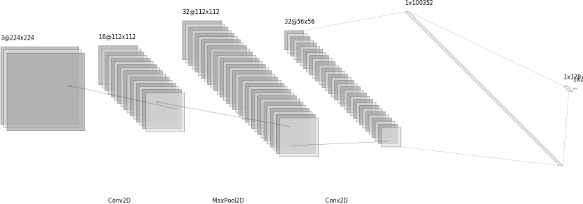

# Part 1: Computer vision for classification task



## 00 Introduction

The goal for this part is to train a computer vision model for classifying if an image consist of either a dog or a cat.
It is important to note that the task of classification assumes that the image contains a clear subject: either one cat or one dog. The model is designed to predict a single class label (e.g., 'cat' or 'dog') for the entire image. This is also known as binary classification. Other types of classification tasks are multi-class classification and multi-label classification tasks.

## 01 Dataset information



The dataset which has been chosen can be found [here](https://www.kaggle.com/datasets/shaunthesheep/microsoft-catsvsdogs-dataset). To download the dataset, you can click on the link, and click "Download" which is to the right. Afterwards, click "Download dataset as zip". Unzip the file, and add it to the JupyterHub environment.

The dataset consists of 25.000 images of cats and dogs.
Inside the folder `PetImages` there are two folders which is called `Cat` and `Dog`. The dataset is split into two folders: `Cat` and `Dog`. Inside the folder `Cat` there are 12.500 images of cats and inside the folder `Dog` there are 12.500 images of dogs.

In computer vision there is something called augmentations and/or transformations. The purpose with transformations is to augment the dataset in order to increase the generalization of the model. This is done by applying random transformations to the images in the dataset. The transformations can be applied to the training dataset, but not to the validation dataset. The validation dataset should be kept as close to the original dataset as possible.

This technique of is a commonly used in computer vision tasks, and has proven to have a large impact on the performance of the model. The transformations can be applied to the dataset in different ways, such as flipping the image horizontally or vertically, rotating the image, changing the brightness of the image, etc.

### Task 1

Go to: `dataset.py` and look at the code which prepares the dataset for training.

Try to look into the [documentation of torchvision transforms](https://pytorch.org/vision/stable/transforms.html) and see if you can find a way to apply the following transformations to the dataset `RandomHorizontalFlip`.

**Extra**:

- Are there any other augmentations which could be applied to the dataset?
- Are there any augmentations which should not be applied to the dataset? If so, why?

## 02 Model set-up

The model which has been chosen for this task is a Convolutional Neural Network (CNN). The CNN is a type of neural network which is designed to recognize patterns in images. The CNN is designed to automatically and adaptively learn spatial hierarchies of features from the data. The CNN is designed to take advantage of the 2D structure of an input image.

The training process is done by feeding the input image into the model and predicting a label. The predicted label is then compared to the true label. The error between the predicted label and the true label is then minimized by updating the weights of the model. The weights can be initialized randomly and will be updated during the training process. By using a process called backpropagation the weights will be updated accordingly.

The model we have chosen is a simple CNN with the following architecture:


In code it looks like this, the model itself is defined in `trainer.py`:

```python
self.model = nn.Sequential(
    nn.Conv2d(3, 16, kernel_size=3, stride=1, padding=1),
    nn.ReLU(),
    nn.MaxPool2d(kernel_size=2, stride=2),
    nn.Conv2d(16, 32, kernel_size=3, stride=1, padding=1),
    nn.ReLU(),
    nn.MaxPool2d(kernel_size=2, stride=2),
    nn.Flatten(),
    nn.Linear(32 * 56 * 56, 128),
    nn.ReLU(),
    nn.Linear(128, num_classes),
)
```

1. First layer (`Conv2D`):

- Looks for small patterns in the image using 16 "filters." Each filter captures features like edges or textures.
- The `ReLU` activation makes sure the output is non-negative (it removes negative values).
- Then, it downsamples (shrinks) the image by half using a MaxPool layer, keeping only the most important details in small regions.

2. Second layer (another `Conv2D`):

- Adds more filters (32 this time) to detect more complex features, like shapes or patterns.
- Again, it applies `ReLU` to keep the outputs positive and shrinks the image further using another MaxPool.

3. Flatten:

- At this point, the image is no longer treated as a grid. It’s flattened into a long list of numbers (like unrolling a rug) so it can be passed into fully connected layers.

4. First Dense Layer (`Linear`):

- Takes the long list of numbers and reduces it to 128 features. These are like a summary of what the model has learned about the image so far.
- Another `ReLU` makes sure everything stays positive.

5. Output Layer (`Linear`):

- Finally, it reduces the 128 features to num_classes (e.g., 2 if it’s a binary classification). This gives the scores for each class.

6. Result:

- The model predicts which class the image most likely belongs to based on these scores.

### Task 2

Go to: `main.py` and look at the code which trains the model. You will see that there is reference to a `config` file. Open the `config.yaml` and have a look at the parameters. What do you think they do and if you change them, what do you think would be the influence on model training?


## 03 Model training

To train the model we need to define a loss function and an optimizer. The loss function is designed to measure the error between the predicted label and the true label. The optimizer is designed to minimize the error between the predicted label and the true label.

The loss function which has been chosen for this task is the Binary Cross Entropy loss function. The Binary Cross Entropy loss function is designed to measure the error between the predicted label and the true label. The Binary Cross Entropy loss function is designed to be used for binary classification tasks.

The optimizer which has been chosen for this task is the Adam optimizer. The Adam optimizer is designed to minimize the error between the predicted label and the true label. The Adam optimizer is designed to be used for training deep learning models.

### Task 3

Run the following command to train the model:

```bash
python 01_classification/src/main.py
```

# TODO: add more tasks

## 04 Model evaluation

To evalute the model we use a tool called Tensorboard. Tensorboard is a tool which is designed to visualize the training process of a deep learning model. Tensorboard is designed to show the loss and accuracy of the model during the training process, which we have been logging in `trainer.py`.

To start Tensorboard run the following command:

```bash
tensorboard --logdir=01_classification/lightnings_logs
```

Then open a browser and go to `http://localhost:6006/` to see the training process of the model.

TODO: add more tasks

## 05 Model inference

To make predictions with the model we have to load the model and pass an image to the model. The model will then predict a label for the image. Luckily there is a Python library which allows for easy "playing around with the model" in a web browser, which is called `Gradio`. Gradio is a Python library which is designed to create web interfaces for machine learning models.

The code for this part is located in `app.py`. To start the web interface run the following command:

```bash
python 01_classification/src/app.py
```

Then open a browser and go to `http://localhost:7860/` to see the web interface. First you need to add the model path, which is a `*.pt`-file. If you then upload an image of a cat or a dog the model will predict if the image contains a cat or a dog.
