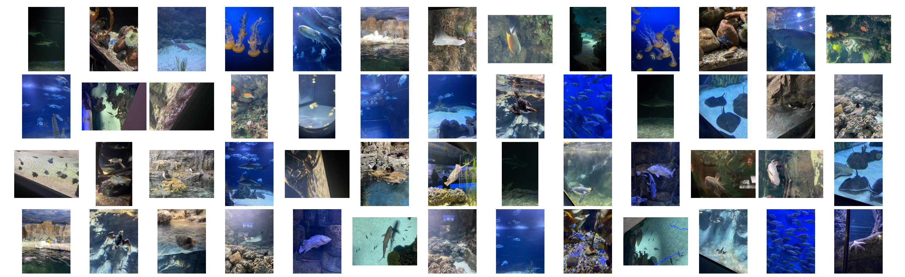

# Part 3: Object detection on aquarium fish



## 00 Introduction

The goal for this task is to train a computer vision model for putting "boxes" (also known as bounding boxes) around fish in an aquarium. Not only do we want to detect the fish, but we also want to know where they are in the image. The model is designed to predict the bounding box coordinates for each fish in the image. This is also known as object detection.

Object detection is a more complex task than classification. In classification, the model predicts a single class label for the entire image. In object detection, the model predicts multiple bounding boxes and class labels for different objects in the image.

## 01 Dataset information

The dataset which has been chosen can be found [here](https://www.kaggle.com/datasets/slavkoprytula/aquarium-data-cots/data). The dataset consists of 7 classes of underwater creatures and contains of 638 images. The images are actuallu from two aquariums in the U.S. The different categories we will be working with are:

- Fish (yes, the labels are not that specific hehe)
- Jellyfish
- Penguins
- Sharks
- Puffins
- Stingrays
- Starfish

The dataset has already been formatted for using with the YOLO model, so we can start training the model right away. The images are in the `images` folder and the annotations are in the `labels` folder.

### Task 1

The first task is to look into `02_object_detection/notebooks` and look at the images we are going to process. Is there more you want to know about the dataset?

*Hint*: Class-imbalance in such projects is a very common problem. Class-imbalance is when one class is over-represented in the dataset compared to other classes. This can lead to poor model performance, as the model may be biased towards the over-represented class.

## 02 Model set-up

For this task we have to use another type of neural network, because this is not a classification task. In the previous task we only needed the model to output two probabilities, one for each class. In this task we need the model to output multiple bounding boxes and class labels for different objects in the image.

The model we have chosen for this task is a YOLOv11 model. YOLO stands for "You Only Look Once" and is a popular object detection model. The model is designed to detect objects in images and videos, which is exactly what we need.

In the file `main.py` the model has been defined, and as you can see, it is not that complicated to set up the model, we have used the `ultralytics` library. The model is pre-trained on the COCO dataset, which is a large dataset with 80 classes. We have to fine-tune the model on our own dataset, which is the aquarium dataset.

## 03 Data augmentation with YOLO and `ultraltyics`

Short recap from previous task: The data augmentation methods are designed to increase the model's performance by generating more training data.

We did some data augmentation in the previous task, but in this task we have to do it in a different way. The `ultralytics` library has built-in data augmentation methods for object detection.

### Task 2

Locate the `data.yaml` file which is in the dataset folder. This current `data.yaml` file contains the class names and the path to the training and test images. This is the file which loads the data to the model.

To add data augmentation to the model training process we have to add some more lines to the `data.yaml` file:

```yaml
augment: true  # Enables augmentations
hsv_h: 0.015   # Hue augmentation (fraction)
hsv_s: 0.7     # Saturation augmentation (fraction)
hsv_v: 0.4     # Value augmentation (fraction)
flipud: 0.0    # Vertical flip probability
fliplr: 0.5    # Horizontal flip probability
mosaic: 1.0    # Mosaic augmentation probability
mixup: 0.2     # MixUp augmentation probability
```

!! OBS: These are just examples of augmentations you can use. You can remove the ones which are irrelevant for this task. You can also change the values as you like.

## 03 Model training

Before we start training we need to make sure that the config is set-up correctly. The config file is located in the `02_object_detection/config` folder. The config file contains all the hyperparameters for the model, such as the learning rate, batch size, and number of epochs. You can change these hyperparameters to improve the model's performance.

### Task 3

To start training the model train the model, we have to run the following command:

```bash
python 02_object_detection/src/main.py 
```

As you can see this code only conists of a few (20) lines of code. The `ultralytics` library does a lot of different stuff under the hood.

## 04 Model evaluation

After training the model, we can evaluate the model's performance on the test set. The model's performance is evaluated using the mean average precision (mAP) metric, and not accuracy as in the previous project. mAP also takes into consideration where predicted bounding box has been placed with respect to the labelled bounding boxes. The higher the mAP score, the better the model's performance.

### Task 4

To evaluate the model open Tensorboard and run the following command:

```bash
tensorboard --logdir=02_object_detection
```

Then open your browser and go to `http://localhost:6006` to view the Tensorboard dashboard. How does the graphs look like? What are the different metrics which have been used to evaluate the model?

## 05 Model inference

After training and evaluating the model, we can use the model to make predictions on new images. The model will output the bounding box coordinates and class labels for different objects in the image.

We have used the same library `gradio` to create a simple web app for making predictions on new images. The web app allows you to upload an image and see the model's predictions in real-time.

### Task 5
To run the web app, run the following command:

```bash
python 02_object_detection/src/app.py
```

Then open your browser and go to `http://localhost:7860` to view the web app. You can upload an image and see the model's predictions in real-time.
