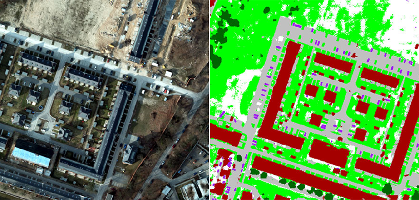

# Part 1: Computer Vision for Image Segmentation



## 00 Introduction

The goal for this part is to train a computer vision model for image segmentation. In an image segmentation task, the objective is to predict a label for each pixel in an image, effectively dividing the image into meaningful regions such as objects and background. This task differs from classification as it outputs a mask instead of a single label.

For example, given an image of a cat and a dog, the model will generate a mask highlighting the pixels corresponding to the cat and the dog separately. This is also known as **semantic segmentation**. Variations include **instance segmentation**, where different instances of the same class are separated, and **panoptic segmentation**, which combines semantic and instance segmentation.

---

## 01 Dataset Information

The dataset chosen for this workshop can be found [here](https://www.kaggle.com/datasets/). It contains satellite images and corresponding pixel-level annotations (masks) for various object categories mentioned in the `label_mapping.json`. Each image is paired with a segmentation mask that labels pixels as belonging to specific objects or background.

The dataset is organized as follows:

- `TAIN_VAL_SET/`: The dataset containing the necessary for training the segmentation model. `TAIN_VAL_SET/` contains two folders, `IMAGES/` and `MASKS/`. `IMAGES/` contains the input images and `MASKS/` contains the segmentation masks corresponding to each image.
- `TEST_SET/`: The dataset used to evaluate the model performance.

In computer vision, data augmentations are essential for increasing the generalization of the model. For image segmentation tasks, augmentations must be applied to both the images and their corresponding masks to ensure consistency. Examples of augmentations include flipping, rotation, and random cropping.

### Task 1

Go to: `dataset.py` and review the code that prepares the dataset for training. Check how the images and masks are loaded and augmented.

Try exploring the [Albumentations library](https://albumentations.ai/docs/) to find augmentations suitable for image segmentation. Consider adding transformations like `HorizontalFlip` or `ShiftScaleRotate`.

**Extra**:
- Which augmentations are suitable for segmentation tasks? 
- Are there any augmentations that could distort the relationship between images and masks? Why?

---

## 02 Model Set-Up

The model chosen for this task is **DeepLabV3 with a ResNet-50 backbone**, a powerful architecture for image segmentation. **DeepLabV3** is designed to perform semantic segmentation by applying atrous convolution to capture multi-scale context and improve segmentation performance.

### DeepLabV3 Architecture

The architecture consists of:

1. **Feature Extractor (ResNet-50 backbone):** Captures hierarchical features from the image at multiple levels.

2. **Atrous Spatial Pyramid Pooling (ASPP):** Uses dilated convolutions to capture information at different scales.

3. **Classifier:** Outputs the final segmentation map by applying a 1x1 convolution to predict pixel-level class labels.

Here’s how the model is initialized in the code (defined in main.py):

```python
def get_deeplabv3_model(num_classes):
    model = models.deeplabv3_resnet50(weights="COCO_WITH_VOC_LABELS_V1")
    model.classifier[4] = torch.nn.Conv2d(256, num_classes, kernel_size=(1, 1))
    return model
```

### Task 2

In `get_deeplabv3_model`, can you interpret the line `model.classifier[4] = torch.nn.Conv2d(256, num_classes, kernel_size=(1, 1))`?

## 03 Model Training

To train the model, we need:

    **Loss Function:** The loss function measures the difference between the predicted mask and the ground truth mask. For this task, we use the Dice Loss, which measures the overlap between the predicted mask and the ground truth mask.
    **Optimizer:** We use the Adam optimizer, which is well-suited for training deep learning models.

### Task 3

Run the following command to train the model:

```
poetry run python src/main.py
```

Once training is complete, review the results on `tensorboard`.

### Task 4

Review `main.py` and examine how the model is trained. Pay attention to:

    The use of the config.yaml file for setting hyperparameters (e.g., learning rate, batch size, number of epochs).
    Change some of the transforms and see how it influences model performance


## 04 Evaluation and Visualization

After training, the model can be evaluated on a **test set**. Metrics such as Intersection over Union (IoU) can be used to assess segmentation performance. IoU (also referred to as the Jaccard Index) calculates the amount of overlapping between two bounding boxes — a predicted bounding box and a ground truth bounding box.


*Image taken from https://www.v7labs.com/blog/intersection-over-union-guide*

Additionally, the predicted masks can be visualized alongside their corresponding input images and ground truth masks. The latter can be done by running `app.py`:

```bash
poetry run python app.py
```

### Task 5

Examine the results to identify areas where the model performs well or struggles (e.g., edges, small objects).

What are some modifications you could add to the pipeline for the model to perform better?