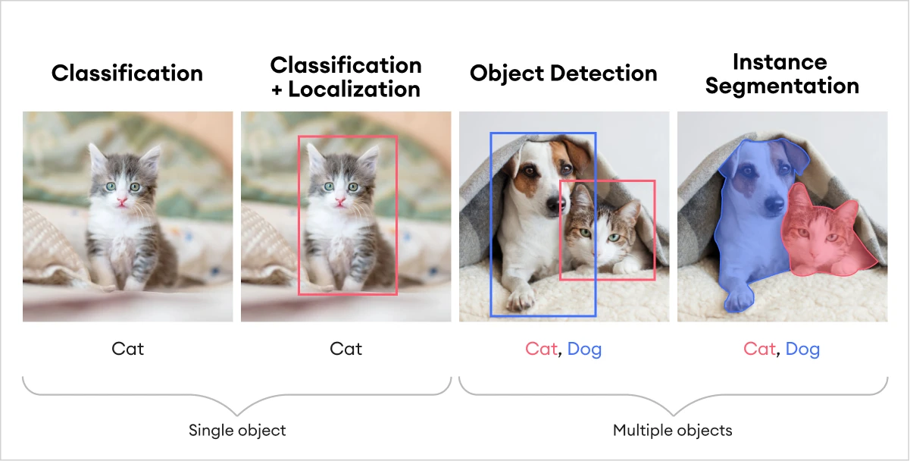

# Computer vision workshop

Code for training and using AI models for computer vision tasks: classification, object detection and segmentation

We are going to introduce you to different Python libraries which can be used for training and using AI models for computer vision tasks. The Python libraries which we are going to use are PyTorch, TorchVision and OpenCV.

During the workshop we are going to train AI models for the following computer vision tasks:

- Classification
- Object detection
- Segmentation



## How is this workshop structured?

Each task is divided into three different folders: `01_classification`, `02_object_detection` and `03_segmentation`. You have been given some "boilerplate" code and some tasks to complete in each folder. The tasks can be found in the folders which all consists of their own `README.md` The tasks are designed to help you understand how to train and use AI models for computer vision tasks.

Please don't be afraid to ask questions if you are stuck or if you need help. We are here to help you and to make sure that you understand the concepts which are being presented.

## Set-up

Before we can get started, we need to install the required Python libraries. We are going to use a Python library called Poetry to manage the dependencies for this project.You can do this by running the following command:

```bash
poetry install
```

When this has succeeded and downloaded all the required libraries, you can activate the virtual environment by running the following command:

```bash
poetry shell
```

Or you can run the following command to install the required libraries:

```bash
source .venv/bin/activate
```

Now you are ready to start the workshop!