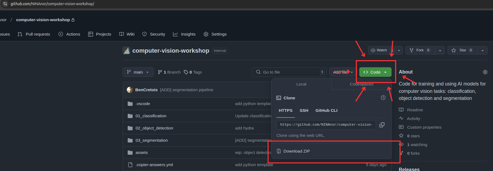
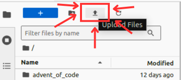
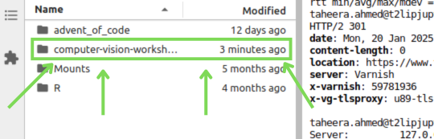

# Computer vision workshop

Code for training and using AI models for computer vision tasks: classification, object detection and segmentation

We are going to introduce you to different Python libraries which can be used for training and using AI models for computer vision tasks. The Python libraries which we are going to use are PyTorch, TorchVision and OpenCV.

During the workshop we are going to train AI models for the following computer vision tasks:

- Classification
- Object detection
- Segmentation


## How is this workshop structured?

Each task is divided into three different folders: `01_classification`, `02_object_detection` and `03_segmentation`. You have been given some "boilerplate" code and some tasks to complete in each folder. The tasks can be found in the folders which all consists of their own `README.md` The tasks are designed to help you understand how to train and use AI models for computer vision tasks.

Please don't be afraid to ask questions if you are stuck or if you need help. We are here to help you and to make sure that you understand the concepts which are being presented.

## Set-up

### How to get the code

1. You can download the code for this workshop by manually downloading the code here, look for the green button which says `Code` on the top of this page and click on it. Then click on `Download ZIP`.



2. Unzip the file

3. Go to [https://jupyterhub.nina.no/](https://jupyterhub.nina.no/) and log in with your username and password.

4. Find the small upload button in the top left corner of the JupyterLab interface. Click on the upload button and upload the unzipped file to the JupyterLab environment.



5. You should now have folder in JupyterLab which is named `computer-vision-workshop`. You can now continue with setting up the development environment.



### How to run the code

Aka. how to set up the development environment.

Before we get started we must activate the correct Python environment. This is to ensure we have downloaded all the necessary Python libraries. We have already created a Python environment for you, so you don't have to worry about that.

1. Open a terminal in JupyterLab by clicking on the `+` sign in the top left corner and then click on `Terminal`.
2. Run the following command to activate the correct Python environment:

```bash
source /data/scratch/.computer-vision-ws-venv/bin/activate
```
